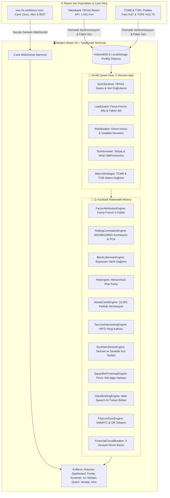

# 🌌 Zenith Atlas — Institutional Quantitative Terminal
### Kurumsal Seviye TEFAS Fon Analitiği, Çoklu Portföy Yönetimi & Kantitatif Strateji Terminali

[](https://cagrik34.github.io/zenith-atlas/)
[](https://react.dev/)
[](https://vite.dev/)
[](https://www.typescriptlang.org/)
[](https://web.dev/progressive-web-apps/)
[](https://opensource.org/licenses/MIT)

---

## 📌 Genel Bakış

**Zenith Atlas**, Türkiye ve küresel sermaye piyasalarında (**TEFAS, Borsa İstanbul, Serbest Piyasa, TCMB**) işlem gören yatırım araçlarını kurumsal fon yöneticisi, aile ofisi (Family Office) ve kantitatif analist standartlarında analiz eden **kurumsal düzeyde açık kaynaklı finansal analiz terminalidir**.

Kullanıcı portföy verilerini hiçbir harici sunucuya aktarmaz (**Zero-Knowledge Client-Side Architecture**); tüm optimizasyon, Fama-French regresyonu, Black-Litterman ve kriz stres testleri doğrudan tarayıcı ortamında istemci tarafında hesaplanır.

---

## 🏛️ Mimari & Veri Akış Şeması



---

## 🌟 Temel Modüller & Fonksiyonel Kabiliyetler

### 1. 🤖 Zenith Quant Hive — 5 Uzman Otonom Ajan Ağı
* **SyncSentinel:** 1.051 TEFAS fonunu ve Takasbank 20:00 seans kapanışını denetler.
* **LeadQuant:** Fama-French 5-Faktör Jensen's Alpha, Beta, Sharpe, Sortino ve Calmar rasyolarını hesaplar.
* **RiskBreaker:** Portföy konsantrasyonu ve volatilite sınırlarını izleyerek 3 seviyeli Devre Kesiciyi (**HEALTHY**, **WARNING**, **TRIPPED**) yönetir.
* **TaxHarvester:** %0 stopajlı Hisse Senedi Yoğun fon geçişlerini ve vergi avantajlarını modeller.
* **MacroStrategist:** TCMB (%37) politika faizi ve enflasyon verilerine göre varlık dağılım önerileri sunar.

### 2. 🧮 İleri Düzey Kantitatif Portföy Analitiği
* **Fama-French 5-Faktör Ayrıştırması:** Piyasa ($\beta$), Büyüklük (SMB), Değer (HML), Kârlılık (RMW) ve Yatırım (CMA) faktörleri üzerinden saf yöneticilik alfa katsayısını hesaplar.
* **Black-Litterman Modeli:** Piyasa dengesi ile yatırımcı görüşlerini Bayesyen istatistikle birleştirir.
* **Hierarchical Risk Parity (HRP):** Marcos Lopez de Prado'nun makine öğrenimi tabanlı kümeleme risk paritesi algoritmasını çalıştırır.
* **Monte Carlo Simülasyonu:** 10.000 iterasyonlu Geometrik Brownian Hareketi ile 1 ila 5 yıllık getiri dağılımlarını modeller.
* **Kriz Stres Testleri:** 2008 Küresel Krizi, 2020 Pandemi Şoku ve 2021 Kur Şoku senaryoları altında portföy dayanıklılığını test eder.

### 3. 🔍 1.051 TEFAS Fonu Filtreleme & Anlık Otomatik Tanıma
* 1.051 resmi TEFAS fonunun tamamını içeren gömülü veritabanı.
* Fon kodu yazıldığı anda **Fon Adı, TEFAS Kategorisi ve Takasbank Güncel Fiyatı** otomatik olarak doldurulur.
* Kategori, getiri, fon büyüklüğü ve yönetim ücretine göre çok kriterli filtreleme ve sayfalama.

### 4. 🗺️ Ağaç Isı Haritası (Squarified Treemap)
* 1.051 TEFAS fonunu ve portföy dağılımını Bruls-Huizing-van Wijk algoritmasıyla orantılı alan blokları ve HSL renk skalasıyla görselleştirir.

### 5. 📑 Goldman Sachs Standartlarında 4 Sayfalık A4 Pitchbook & İcra Özeti
* Varlık dağılımı, faktör katsayıları, kriz simülasyonları ve getiri projeksiyonlarını içeren kurumsal PDF raporlama motoru.

### 6. 🎙️ Zenith Voice AI — Türkçe Sabah Piyasa Bülteni
* Web Speech API tabanlı ses motoru ile portföyün net durumunu, günlük değişimini ve piyasa açılışını seslendirir.

### 7. 📲 P2P QR Kod Mobil Işınlama & Mobil Uyumlu Arayüz
* Portföy verisini hiçbir sunucuya yüklemeden, uçtan uca şifreli doğrudan URL hash ile kameradan taratarak mobil cihaza aktarır.
* Mobil ekranlar için optimize edilmiş alt navigasyon çubuğu (Bottom Dock), kaydırılabilir sekmeler ve dokunmatik çekmece menüsü.

---

## 🚀 Kurulum & Çalıştırma

### Canlı Web Sürümü:
Terminali herhangi bir kurulum yapmadan doğrudan [https://cagrik34.github.io/zenith-atlas/](https://cagrik34.github.io/zenith-atlas/) adresinden kullanabilirsiniz.

### Yerel Geliştirme (Local Development):

#### Gereksinimler:
* **Node.js:** `v20+` (Önerilen: `v22+ LTS`)
* **npm:** `v10+`

```bash
# 1. Depoyu klonlayın
git clone https://github.com/Cagrik34/zenith-atlas.git
cd zenith-atlas

# 2. Bağımlılıkları yükleyin
npm install

# 3. Geliştirme sunucusunu başlatın
npm run dev
# -> http://localhost:3000 adresinde anında açılır.

# 4. Üretim paketini derleyin (Strict TypeScript & PWA)
npm run build

# 5. Üretim önizlemesi
npm run preview
```

---

## 📁 Proje Dizin Yapısı

```text
Zenith-Atlas/
├── 📁 .github/                # GitHub Actions Otomatik Dağıtım (CI/CD)
│   └── 📁 workflows/deploy.yml
├── 📁 public/                 # Statik PWA Varlıkları & İkonlar
│   ├── 📁 data/               # 1.051 TEFAS fonu, piyasa oranları, haberler
│   ├── 📁 icons/              # PWA uygulama ikonları
│   ├── favicon.svg            # Vektörel Z-Prism logosu
│   └── manifest.webmanifest   # PWA mobil manifesti
│
├── 📁 scripts/                # Senkronizasyon Scriptleri (Opsiyonel Manuel Tarayıcı)
│   └── sync.py
│
├── 📁 src/                    # React 19 + TypeScript Kaynak Kodları
│   ├── 📁 components/         # Modüler Bileşenler (Dashboard, Funds, Screener, Quant, vb.)
│   ├── 📁 context/            # PortfolioContext, MarketContext, AgentHiveContext
│   ├── 📁 data/               # Dahili derlenmiş statik veri paketleri
│   ├── 📁 engines/            # 11 Kantitatif Matematik ve Analiz Motoru
│   ├── 📁 hooks/              # useAutoSync, useLivePrices
│   ├── 📁 styles/             # index.css (Kurumsal Tasarım Sistemi)
│   ├── 📁 types/              # Katı TypeScript Tip Tanımları
│   ├── 📁 utils/              # formatters.ts, excelExport.ts, storage.ts
│   ├── App.tsx                # Ana Uygulama & Global Modallar
│   ├── main.tsx               # React 19 Kök Giriş Noktası
│   └── vite-env.d.ts          # Vite Ortam Tip Tanımları
│
├── 📄 index.html              # HTML5 Giriş Dosyası
├── 📄 package.json            # Bağımlılıklar & Scriptler
├── 📄 tsconfig.json           # TypeScript Katı Tip Yapılandırması
└── 📄 vite.config.ts          # Vite 6 + React + PWA Yapılandırması
```

---

## 🛡️ Siber Güvenlik & Gizlilik İlkeleri

* **Zero-Knowledge Architecture:** Portföy büyüklüğü, işlem geçmişi ve nakit bakiyesi hiçbir harici sunucuya veya veritabanına iletilmez; tüm veriler kullanıcının yerel tarayıcısında saklanır.
* **XSS Sanitization:** `escapeHtml` ve React 19 DOM escaping mekanizmaları.
* **Excel DDE Formula Injection Kalkanı:** CSV ve Excel ihraçlarında `=, +, -, @` karakterli formül enjeksiyonu saldırıları temizlenir (`sanitizeCsvCell`).
* **Content Security & Subresource Integrity:** Harici script bağımlılığı barındırmayan yerleşik güvenli mimari.

---

## 📜 Lisans & Telif Hakkı

Bu proje **MIT Lisansı** altında lisanslanmıştır. Detaylar için [LICENSE](LICENSE) dosyasına bakınız.

**Geliştirici:** Çağrı Giray Keşan  
**Telif Hakkı:** © 2026 Çağrı Giray Keşan. Tüm Hakları Saklıdır.
