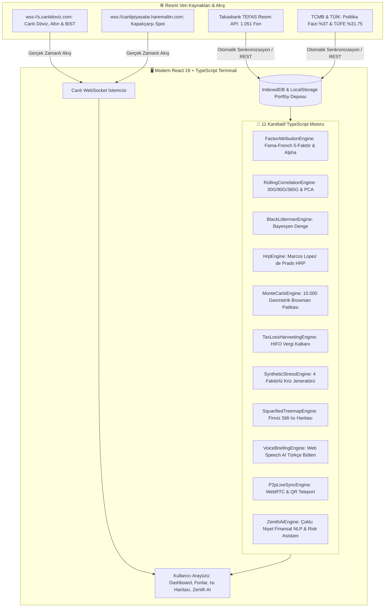

# 🌌 Zenith Atlas — Institutional Quantitative Terminal
### Kurumsal Seviye TEFAS Fon Analitiği, Çoklu Portföy Yönetimi & Kantitatif Strateji Terminali

[](https://react.dev/)
[](https://vite.dev/)
[](https://www.typescriptlang.org/)
[](https://web.dev/progressive-web-apps/)
[](https://opensource.org/licenses/MIT)

---

## 📌 Genel Bakış & Felsefe

**Zenith Atlas**, Türkiye ve küresel sermaye piyasalarında (**TEFAS, Borsa İstanbul, Serbest Piyasa, TCMB**) işlem gören tüm yatırım araçlarını kurumsal fon yöneticisi, aile ofisi (Family Office) ve kantitatif analist standartlarında analiz eden **yeni nesil kurumsal finans terminalidir**.

Kullanıcı portföy verilerini hiçbir harici sunucuya aktarmaz (**Zero-Knowledge Client-Side Architecture**); tüm optimizasyon, Fama-French regresyonu ve kriz stres testleri doğrudan istemci tarafında **milisaniyeler içinde** hesaplanır.

---

## 🏛️ Mimari & Veri Akış Şeması



---

## 🌟 Amiral Gemisi Modüller & Özellikler

### 1. 🤖 Zenith Intelligence AI — Çoklu Niyet Finansal Zeka Motoru
* Doğal Dil İşleme (NLP) ile stopaj mevzuatı (GVK Geçici 67), %0 vergi kalkanı, Sharpe rasyosu, Fama-French alfa katsayıları ve devalüasyon şok simülasyonlarını dinamik KPI kartlarıyla yanıtlar.

### 2. 🧮 Fama-French 5-Faktör & Jensen's Alpha Ayrıştırması
* BIST 100 piyasa riski ($\beta$), Büyüklük (SMB), Değer (HML), Kârlılık (RMW) ve Yatırım (CMA) faktörleri üzerinden portföyün saf yöneticilik katma değerini (**Jensen's Alpha**) hesaplar.

### 3. 📊 Goldman Sachs Standartlarında 4 Sayfalık A4 Pitchbook
* Tek tıkla koyu cam kurumsal temalı, taşmasız ve kurumsal yatırım komitesi standartlarında A4 PDF çıktısı üretir.

### 4. 🗺️ Squarified Finviz / S&P 500 Tarzı Isı Haritası (Treemap)
* 1.051 TEFAS fonunu ve BIST 100 sektörlerini orantılı kare bloklar ve dinamik HSL renk skalasıyla görselleştirir.

### 5. 🎙️ Zenith Voice AI — Türkçe Sabah Piyasa Bülteni
* Web Speech API tabanlı ses sentezleyici ile portföyün net durumunu ve piyasa açılışını doğal Türkçe olarak seslendirir.

### 6. 📜 2026 Gelir İdaresi Uyumlu Vergi Kayıp Hasadı & HIFO Optimizasyonu
* BIST hisse yoğun fonlardaki **%0 stopaj muafiyetini** ve genel fonlardaki **%17,50 stopajı** analiz eder; zarardaki lotlar için ikame fon haritalaması sunar.

### 7. 🌊 60 FPS Canlı Ticker & Yeşil/Kırmızı Renk Dalgası (Price Flash Waves)
* Döviz, altın, gümüş ve BIST endekslerini sıfır gecikmeli WebSocket üzerinden donanım hızlandırmalı (`transform: translate3d`) olarak kesintisiz kaydırır; her yeni fiyatta neon renk dalgaları üretir.

---

## 🚀 Hızlı Başlangıç (Quickstart)

> **💡 Sıfır Müdahale ile Otomatik Senkronizasyon:**  
> Projeyi ayağa kaldırdığınız anda (`npm run dev`) veya tarayıcıda açtığınızda, tüm canlı piyasa verileri (Dolar, Euro, Altın, BIST 100) ve Takasbank TEFAS fon fiyatları **arka planda %100 dinamik ve otomatik olarak güncellenir**. Kullanıcının hiçbir harici script, komut veya terminal işlemi yapmasına **gerek yoktur**.

### Gereksinimler:
* **Node.js:** `v20+` (Önerilen: `v24+ LTS`)
* **Python (Opsiyonel):** `3.10+` (Yalnızca manuel veri tarama scripti için)

### Kurulum & Çalıştırma:

```bash
# 1. Bağımlılıkları Yükleyin (Tek Seferlik)
npm install

# 2. Canlı Geliştirme Sunucusunu Başlatın (Hot Module Replacement)
npm run dev
# -> http://localhost:3000 adresinde anında açılır ve canlı veri akışı başlar.

# 3. Üretim Paketi Derleyin (Strict TypeScript Check & PWA)
npm run build

# 4. Üretim Paketi Önizlemesi
npm run preview
```

---

## 📁 Proje Dizin Mimarisi

```text
Zenith-Atlas/
├── 📁 public/                 # Statik PWA Varlıkları (Veritabanı, İkonlar, Manifest)
│   ├── 📁 data/               # 1.051 TEFAS fonu, piyasalar, fiyatlar (JSON)
│   ├── 📁 icons/              # Mobil PWA uygulama ikonları (192px, 512px)
│   ├── favicon.svg            # Vektörel kurumsal Z-Prism logosu
│   └── manifest.webmanifest   # PWA mobil konfigürasyonu
│
├── 📁 scripts/                # Python Senkronizasyon Motoru (Opsiyonel Manuel Tarayıcı)
│   └── sync.py                # Resmi TEFAS & WebSocket Canlı Veri Çekici
│
├── 📁 src/                    # %100 Saf React 19 + TypeScript Mimarisi
│   ├── 📁 components/         # Modüler TSX Bileşenleri (Dashboard, Fonlar, Isı Haritası, AI vb.)
│   ├── 📁 context/            # PortfolioContext & MarketContext (Canlı WebSocket)
│   ├── 📁 engines/            # 11 Matematik, Finans ve NLP Motoru (.ts)
│   ├── 📁 hooks/              # useAutoSync, useLivePrices Özel Kancaları
│   ├── 📁 styles/             # index.css (Tekil ve Modern CSS Tasarım Sistemi)
│   ├── 📁 types/              # Katı TypeScript Tip Tanımları (.ts)
│   ├── 📁 utils/              # formatters.ts, excelExport.ts, storage.ts
│   ├── App.tsx                # Ana Uygulama Düzeni ve Sekme Yönlendirici
│   └── main.tsx               # React 19 Giriş Noktası (Root)
│
├── 📄 index.html              # Modern Vite SPA Giriş HTML'i
├── 📄 package.json            # React 19, TypeScript 5.8+, Vite 6, Chart.js
├── 📄 requirements.txt        # Python crawler kütüphaneleri (tefas-crawler, websockets)
├── 📄 start.bat               # Windows tek tıkla başlatıcı
├── 📄 tsconfig.json           # Katı Tip Denetimi Ayarları (Strict TS)
└── 📄 vite.config.ts          # Vite 6 + React SWC + PWA Ayarları
```

---

## 🛡️ Siber Güvenlik & Gizlilik İlkeleri

* **Zero-Knowledge Architecture:** Portföy büyüklüğü, lot maliyetleri ve nakit bakiyesi hiçbir harici sunucuya veya buluta kaydedilmez.
* **XSS Sanitization:** `escapeHtml` ve React 19 yerleşik DOM escaping koruması.
* **Excel DDE Injection Shield:** CSV ve Excel ihraçlarında `=, +, -, @` karakterli formül enjeksiyonu saldırıları engellenir.
* **Subresource Integrity (SRI):** Güvenli CDN ve yerleşik statik bağımlılık doğrulaması.

---

## 📜 Lisans & Telif Hakkı

Bu proje **MIT Lisansı** altında lisanslanmıştır. Detaylar için [LICENSE](LICENSE) dosyasına bakınız.

**Geliştirici:** Çağrı Giray Keşan  
**Telif Hakkı:** © 2026 Çağrı Giray Keşan. Tüm Hakları Saklıdır.
