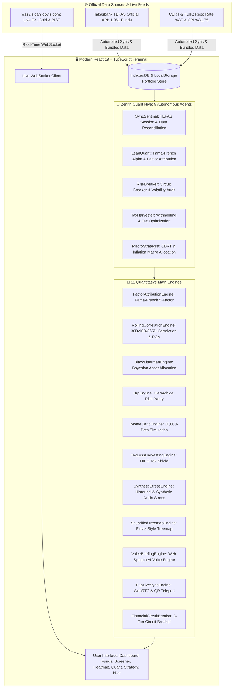

# 🌌 Zenith Atlas — Institutional Quantitative Finance Terminal

> High-Performance TEFAS Mutual Funds Analytics, Multi-Asset Portfolio Management & Quantitative Strategy Engine.

[](https://opensource.org/licenses/MIT)
[](https://react.dev/)
[](https://www.typescriptlang.org/)
[](https://vitejs.dev/)
[](https://web.dev/progressive-web-apps/)

[🇹🇷 Türkçe Dokümantasyon için tıklayınız](./README.tr.md)

---

## 📌 Overview

**Zenith Atlas** is an open-source, institutional-grade quantitative analytics and portfolio management terminal designed for asset managers, family offices, and quantitative researchers tracking Turkish and global capital markets (1,051 TEFAS mutual funds, Borsa Istanbul, FX, commodities, and CBRT macroeconomic indicators).

Operating under a **Zero-Knowledge Client-Side Architecture**, zero portfolio telemetry or trade data is transmitted to external servers. All factor regressions, Bayesian allocations, and Monte Carlo stress tests execute entirely in-browser.

---

## 🏛️ Architecture & Data Flow Diagram



---

## 🌟 Core Modules & Capabilities

### 1. 🤖 Zenith Quant Hive — 5 Autonomous Agents
* **SyncSentinel:** Monitors 1,051 TEFAS mutual funds and executes Takasbank 20:00 session settlement reconciliation.
* **LeadQuant:** Computes Fama-French 5-Factor attribution, Jensen's Alpha, Beta, Sharpe, Sortino, and Calmar ratios.
* **RiskBreaker:** Continuously tracks volatility thresholds and portfolio concentration, enforcing a 3-tier circuit breaker (`HEALTHY`, `WARNING`, `TRIPPED`).
* **TaxHarvester:** Simulates HIFO tax loss harvesting and optimizes allocations under Turkish Presidential Decree 9075 (0% withholding tax equity funds).
* **MacroStrategist:** Evaluates macro regimes based on CBRT policy rates and inflation dynamics to recommend asset allocation tilts.

### 2. 🧮 Advanced Quantitative Portfolio Analytics
* **Fama-French 5-Factor Decomposition:** Decomposes returns across Market ($\beta$), Size (SMB), Value (HML), Profitability (RMW), and Investment (CMA) factors to isolate pure managerial alpha.
* **Black-Litterman Model:** Blends market equilibrium with subjective investor views using Bayesian statistical shrinkage.
* **Hierarchical Risk Parity (HRP):** Executes machine learning-based hierarchical tree clustering (Marcos Lopez de Prado) for robust diversification without matrix inversion.
* **Monte Carlo Simulation:** 10,000-path Geometric Brownian Motion (GBM) projecting 1-to-5-year probabilistic return cones.
* **Crisis Stress Testing:** Simulates portfolio drawdown under historical shocks: 2008 Global Financial Crisis, 2020 Pandemic Shock, and 2021 Turkish Lira FX Shock.

### 3. 🔍 1,051 Mutual Funds Screener & Recognition Engine
* Embedded offline database indexing all 1,051 official TEFAS mutual funds.
* Sub-millisecond code lookup auto-populates fund metadata, category classification, and Takasbank settlement pricing.
* Multi-criteria sorting and filtering by AUM, expense ratio, annualized alpha, and category.

### 4. 🗺️ Squarified Treemap Heatmap
* Visualizes 1,051 TEFAS funds and user portfolios via the **Bruls-Huizing-van Wijk** tiling algorithm using HSL dynamic color scales.

### 5. 📑 Institutional 4-Page A4 Pitchbook Engine
* Generates comprehensive Goldman-standard A4 PDF executive summaries containing factor attributions, risk metrics, and simulation paths.

### 6. 🎙️ Zenith Voice AI
* Web Speech API-powered voice engine synthesizing daily portfolio summaries, net asset values, and market opening briefings in Turkish.

### 7. 📲 Serverless P2P Mobile Teleportation
* Zero-cloud, camera-based mobile portfolio synchronization via high-density URL hash QR teleportation.
* Mobile-first responsive UI featuring bottom dock navigation, swipeable tabs, and touch drawers.

### 8. 🛡️ Fault-Tolerant React 19 Error Boundary
* Enterprise runtime resilience layer preventing white-screen crashes, isolating UI state faults, and enabling graceful local data recovery.

---

## 🚀 Getting Started

### Live Terminal
Access the production build directly with zero setup:
👉 **[https://cagrik34.github.io/zenith-atlas/](https://cagrik34.github.io/zenith-atlas/)**

### Local Development

**Prerequisites:**
* Node.js v20+ (v22+ LTS recommended)
* npm v10+

```bash
# 1. Clone repository
git clone https://github.com/Cagrik34/zenith-atlas.git
cd zenith-atlas

# 2. Install dependencies
npm install

# 3. Start development server
npm run dev

# 4. Build for production (Strict TypeScript & PWA)
npm run build

# 5. Preview production build locally
npm run preview
```

---

## 📁 Directory Structure

```text
zenith-atlas/
├── .github/                # CI/CD GitHub Actions deployment workflows
├── public/                 # Static PWA assets, manifest, and icons
├── scripts/                # Python-based data ingestion & sync utilities (sync.py)
├── src/
│   ├── components/         # Modular UI components (Dashboard, Quant, Screener, etc.)
│   ├── context/            # React Contexts (Portfolio, Market, AgentHive)
│   ├── data/               # Bundled static datasets
│   ├── engines/            # 11 Quantitative mathematical analysis engines
│   ├── hooks/              # Custom reactive hooks (useAutoSync, useLivePrices)
│   ├── styles/             # Enterprise Glassmorphism design system
│   ├── types/              # Strict TypeScript definitions
│   └── utils/              # Export formats, math helpers, and storage drivers
├── index.html              # Entry HTML5 document
├── package.json            # Node.js dependencies and build scripts
├── tsconfig.json           # Strict TypeScript configuration
└── vite.config.ts          # Vite 6 + manualChunks Rollup optimization
```

---

## 🛡️ Security & Zero-Knowledge Architecture

* **Zero-Knowledge Execution:** Portfolio balances, trade histories, and cost positions remain strictly in local browser storage (`IndexedDB` / `localStorage`).
* **Sanitization:** Input escaping with `escapeHtml` and React 19 DOM safeguards.
* **Formula Injection Defense:** CSV/Excel export cells sanitized via `sanitizeCsvCell` against Excel Dynamic Data Exchange (DDE) formula execution (`=`, `+`, `-`, `@`).

---

## 📜 License & Copyright

Distributed under the **MIT License**. See `LICENSE` for details.

**Author:** Çağrı Giray Keşan  
**Copyright:** © 2026 Çağrı Giray Keşan. All Rights Reserved.
