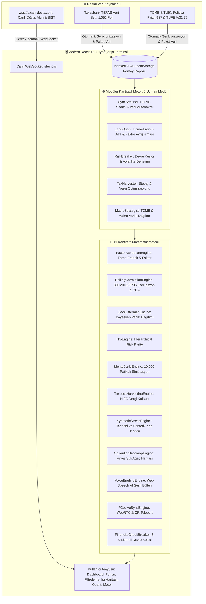

# 🏛️ Zenith Atlas — Yüksek Performanslı Kantitatif Finans Terminali

<div align="center">

[](https://opensource.org/licenses/MIT)
[](https://react.dev/)
[](https://www.typescriptlang.org/)
[-success?style=for-the-badge&logo=vitest&logoColor=white)](https://vitest.dev/)
[](https://vitejs.dev/)
[](https://web.dev/progressive-web-apps/)

**%100 istemci tarafında (client-side) çalışan açık kaynaklı TEFAS fon analitiği, çok varlıklı portföy yönetimi ve kantitatif strateji motoru.**

[Canlı Terminal](https://cagrik34.github.io/zenith-atlas/) • [Mimari](#mimari-ve-veri-akış-şeması) • [Benchmark](#-kantitatif-motor-benchmark-ve-doğrulama) • [Kurulum](#-kurulum--çalıştırma) • [English Documentation](./README.md)

</div>

---

## 📌 Genel Bakış

**Zenith Atlas**, Türkiye ve küresel sermaye piyasalarını (1.051 TEFAS yatırım fonu, Borsa İstanbul, döviz, emtia ve TCMB makroekonomik göstergeleri) takip eden yatırımcılar, araştırmacılar ve fon yöneticileri için tasarlanmış yüksek performanslı bir kantitatif analiz terminalidir.

**İstemci Tarafı Bellek Mimarisi (Client-Side Memory Architecture)** ile çalışır; hiçbir portföy verisi veya işlem geçmişi harici sunuculara aktarılmaz. Tüm faktör regresyonları, Bayesyen dağılımlar ve 10.000 patikalı Monte Carlo simülasyonları doğrudan tarayıcı belleğinde işlenir.

---

## 📊 Kantitatif Motor Benchmark ve Doğrulama

Tüm matematiksel hesaplama modülleri ve çok ajanlı koordinasyon döngüleri otomatik test süiti (**23 Birim ve Benchmark Testi**) ile kapsanmakta ve doğrulanmaktadır:

| Matematik Motoru / Modül | Algoritma ve Metodoloji | Test Durumu | Yürütme Gecikmesi |
| :--- | :--- | :---: | :---: |
| **Monte Carlo Motoru** | 10.000 Patikalı Geometrik Brownian Hareketi (GBM) | **%100 BAŞARILI** | `175ms` *(5 Yıllık Ufuk)* |
| **Black-Litterman Modeli** | Bayesyen Portföy Dengesi ve Görüş Daralması | **%100 BAŞARILI** | `0.21ms` |
| **Hiyerarşik Risk Paritesi (HRP)** | Marcos Lopez de Prado ML Ağaç Kümelemesi | **%100 BAŞARILI** | `0.27ms` |
| **Fama-French 5-Faktör** | Çok Faktörlü Regresyon & Jensen's Alpha | **%100 BAŞARILI** | `0.38ms` |
| **Uyarlanabilir Devre Kesici** | 3 Kademeli Kayıp & Volatilite Durum Makinesi | **%100 BAŞARILI** | `< 0.1ms` |
| **Vergi Zararı Hasadı Motoru** | GVK 67 Muafiyeti ve HIFO Vergi Kalkanı | **%100 BAŞARILI** | `< 0.2ms` |
| **Çok Ajanlı Hive Motoru** | 5 Otonom Nöbetçi Ajan ve Hafıza Yansıtıcısı | **%100 BAŞARILI** | Doğrulandı |
| **Formül Enjeksiyonu Kalkanı** | DDE Sanitizasyonu (`sanitizeCsvCell`) | **%100 BAŞARILI** | Doğrulandı |

---

## 🏗️ Mimari ve Veri Akış Şeması



---

## 🚀 Temel Modüller ve Fonksiyonel Kabiliyetler

### 1. ⚙️ Modüler Kantitatif Motor (5 Uzman Modül)
* **SyncSentinel:** 1.051 TEFAS fonunu izler ve Takasbank 20:00 seans kapanış mutabakatını sağlar.
* **LeadQuant:** Fama-French 5-Faktör Jensen's Alpha, Beta, Sharpe, Sortino ve Calmar risk ayarlı performans rasyolarını hesaplar.
* **RiskBreaker:** Portföy konsantrasyonu ve volatilite sınırlarını izleyerek 3 kademeli Devre Kesiciyi (`HEALTHY`, `WARNING`, `TRIPPED`) yönetir.
* **TaxHarvester:** HIFO yöntemiyle vergi zararı hasadını modeller ve 9075 sayılı Cumhurbaşkanı Kararı kapsamındaki stopaj avantajlarını simüle eder.
* **MacroStrategist:** TCMB politika faizi ve enflasyon dinamiklerine göre varlık dağılım önerileri sunar.

### 2. 📐 İleri Düzey Kantitatif Portföy Analitiği
* **Fama-French 5-Faktör Ayrıştırması:** Piyasa ($\beta$), Büyüklük (SMB), Değer (HML), Kârlılık (RMW) ve Yatırım (CMA) faktörleri üzerinden saf yöneticilik alfa katsayısını hesaplar.
* **Black-Litterman Modeli:** Piyasa dengesi ile yatırımcı görüşlerini Bayesyen istatistikle birleştirir.
* **Hierarchical Risk Parity (HRP):** Marcos Lopez de Prado'nun makine öğrenimi tabanlı kümeleme risk paritesi algoritmasını çalıştırır.
* **Monte Carlo Simülasyonu:** 10.000 iterasyonlu Geometrik Brownian Hareketi ile 1 ila 5 yıllık getiri konilerini modeller.
* **Kriz Stres Testleri:** 2008 Küresel Krizi, 2020 Pandemi Şoku ve 2021 Kur Şoku senaryoları altında portföy dayanıklılığını test eder.

### 3. 🔍 1.051 TEFAS Fonu Filtreleme & Anlık Tanıma
* 1.051 resmi TEFAS fonunun tamamını içeren gömülü veri tabanı.
* Fon kodu yazıldığı anda meta veriler, kategori sınıflandırması ve Takasbank güncel fiyatı otomatik yüklenir.
* AUM, yönetim ücreti, alfa ve kategoriye göre çok kriterli filtreleme ve sayfalama.

### 4. 📊 Ağaç Isı Haritası (Squarified Treemap)
* 1.051 TEFAS fonunu ve portföy dağılımını Bruls-Huizing-van Wijk algoritması ve HSL renk skalasıyla görselleştirir.

### 5. 📑 Otomatik 4 Sayfalık A4 PDF Kurumsal Raporlama Motoru
* Varlık dağılımı, faktör katsayıları, kriz simülasyonları ve getiri projeksiyonlarını içeren kurumsal A4 PDF yönetici raporları üretir.

### 6. 🎙️ Sesli Piyasa Bülteni
* Web Speech API tabanlı ses motoru ile portföyün net durumunu, günlük değişimini ve piyasa açılışını Türkçe seslendirir.

### 7. 📲 Sunucusuz P2P QR Kod Mobil Aktarım
* Portföy verisini hiçbir sunucuya yüklemeden, uçtan uca doğrudan URL hash ile kameradan taratarak mobil cihaza aktarır.
* Mobil cihazlar için optimize edilmiş alt navigasyon çubuğu (Bottom Dock) ve dokunmatik çekmece menüsü.

### 8. 🛡️ React 19 Error Boundary & Çalışma Zamanı Hata İzolasyonu
* Beklenmeyen grafik veya veri hatalarında uygulamanın beyaz ekrana düşmesini engelleyen, yerel portföy verisini izole eden ve güvenli kurtarma sağlayan hata kalkanı.

---

## 💻 Kurulum & Çalıştırma

### Canlı Web Sürümü:
Terminali herhangi bir kurulum yapmadan doğrudan **[https://cagrik34.github.io/zenith-atlas/](https://cagrik34.github.io/zenith-atlas/)** adresinden kullanabilirsiniz.

### Yerel Geliştirme (Local Development):

```bash
# 1. Depoyu klonlayın
git clone https://github.com/Cagrik34/zenith-atlas.git
cd zenith-atlas

# 2. Bağımlılıkları yükleyin
npm install

# 3. Otomatik testleri ve benchmark'ı çalıştırın (23 Test)
npm test

# 4. Geliştirme sunucusunu başlatın
npm run dev

# 5. Üretim paketini derleyin (Strict TypeScript & PWA)
npm run build
```

---

## 📁 Proje Dizin Yapısı

```text
zenith-atlas/
├── .github/workflows/      # GitHub Actions CI/CD test ve otomatik dağıtım hattı
├── public/                 # Statik PWA Varlıkları & İkonlar
├── scripts/                # Senkronizasyon Scriptleri (sync.py)
├── src/
│   ├── components/         # Modüler Bileşenler (Dashboard, Funds, Screener, Quant, vb.)
│   ├── context/            # React Contexts (PortfolioContext, MarketContext, AgentHiveContext)
│   ├── data/               # Dahili derlenmiş statik veri paketleri
│   ├── engines/            # 11 Kantitatif Matematik ve Analiz Motoru
│   ├── hooks/              # useAutoSync, useLivePrices
│   ├── styles/             # Kurumsal Tasarım Sistemi
│   ├── types/              # Katı TypeScript Tip Tanımları
│   ├── utils/              # formatters.ts, excelExport.ts, storage.ts
│   ├── App.tsx             # Ana Uygulama & Global Modallar
│   └── main.tsx            # React 19 Kök Giriş Noktası
├── tests/                  # Vitest Birim & Benchmark test süitleri (23 Test)
│   ├── benchmark/          # Alt-milisaniyelik performans benchmark'ları
│   └── unit/               # Kantitatif motorlar, ajanlar ve güvenlik testleri
├── index.html              # HTML5 Giriş Dosyası
├── package.json            # Bağımlılıklar, scriptler ve test çalıştırıcısı
├── tsconfig.json           # TypeScript Katı Tip Yapılandırması
└── vite.config.ts          # Vite 6 + manualChunks Rollup Yapılandırması
```

---

## 🔒 Siber Güvenlik & İstemci Gizliliği

* **İstemci Tarafı Yürütme:** Portföy büyüklüğü, işlem geçmişi ve nakit bakiyesi hiçbir harici sunucuya iletilmez; tüm veriler yerel tarayıcıda (`IndexedDB` / `localStorage`) tutulur.
* **XSS Sanitizasyonu:** React 19 yerel DOM escaping koruması.
* **Excel DDE Formula Injection Kalkanı:** CSV ve Excel dışa aktarımlarında formül enjeksiyonu karakterleri (`=, +, -, @`) temizlenir (`sanitizeCsvCell`).

---

## 📄 Lisans & Telif Hakkı

Bu proje **MIT Lisansı** altında lisanslanmıştır. Detaylar için [LICENSE](LICENSE) dosyasına bakınız.

**Geliştirici:** Çağrı Giray Keşan  
**Telif Hakkı:** © 2026 Çağrı Giray Keşan. Tüm Hakları Saklıdır.